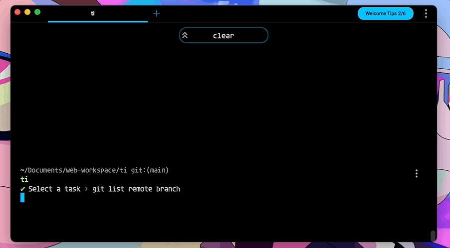
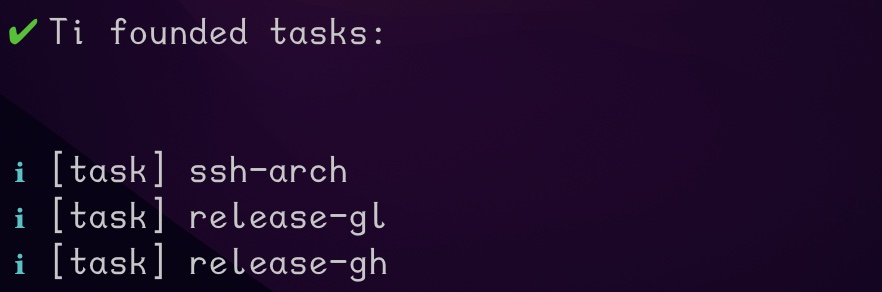
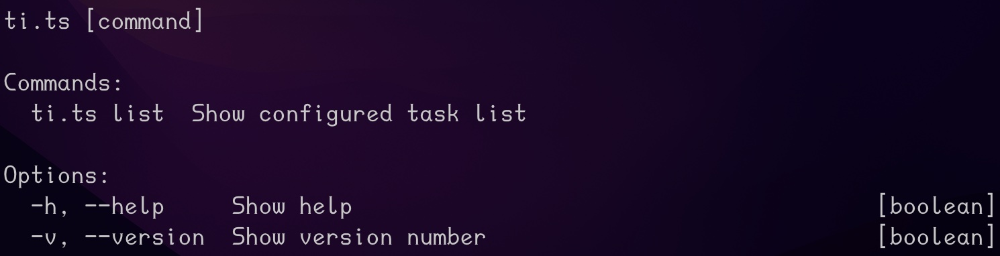

# ti

[](https://github.com/lumenghz/ti/actions/workflows/test.yml)



Just task it...

`ti` is a task runner CLI driven by configuration. I have a lot of frequently used commands, especially some with different parameters or very long, so `ti` is to solve this problem.

## Install

```shell
npm install -g @dennislu/ti
```

## Commands

### list

List all task names in your configuration file.

```shell
ti list
```



### -h, --help

```shell
ti -h
```



## Configuration

A [json-schema definition](./schema/ti-config-schema-v1.json) is provided, you can use it for tips in your editor.

### Steps

- Create a configuration file at user's config folder
  - Windows: 
  - Linux/MacOS: `$HOME/.config/ti/config.yml`

### Example

```yaml
# optional, default '1'
version: '1'

tasks:
  - name: git list remote branch
    env:
      GH_TOKEN: blablabla
    cmds:
      - git fetch -p
      - type: shell
        value: git branch -a | awk '{print $1}'

  - name: sample of text (shorthand)
    cmds:
      # param will be type: 'text' if you not declare it in params
      - echo hello $(?name)
  - name: sample of text
    cmds:
      - value: echo hello $(?name)
        params:
          name:
            type: text

  - name: sample of select
    cmds:
      - value: echo eat $(?fruit)
        params:
          fruit:
            type: select
            choices:
              - Avocado
              - Breadfruit
              - Kiwi Berry

  - name: sample of mixed
    cmds:
      - echo hello $(?yourname)
      - value: echo eat $(?fruit)
        params:
          fruit:
            type: select
            choices:
              - Avocado
              - Breadfruit
              - Kiwi Berry
```
